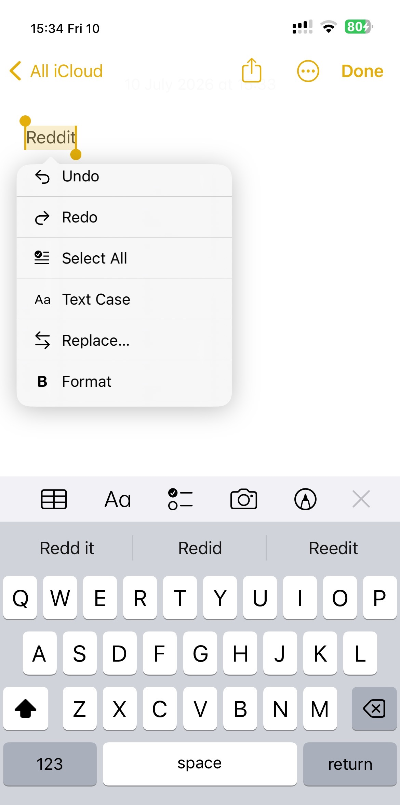
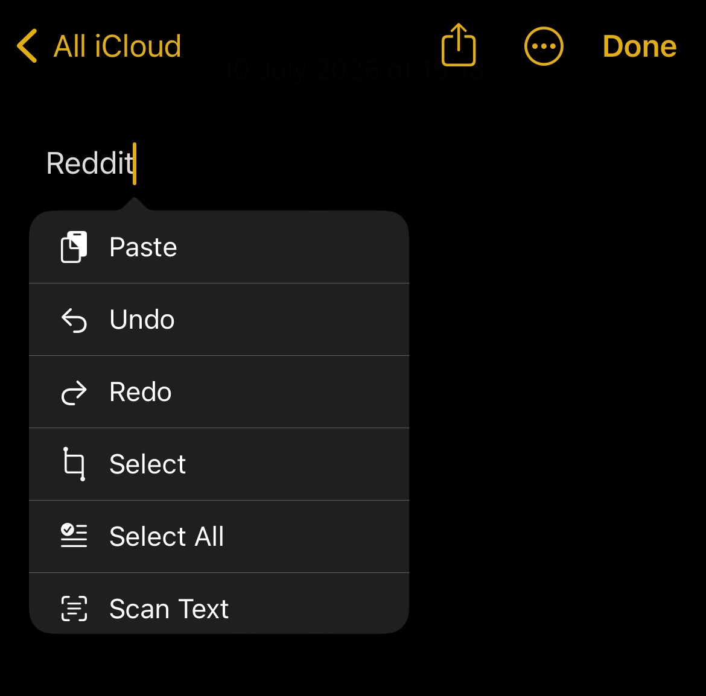
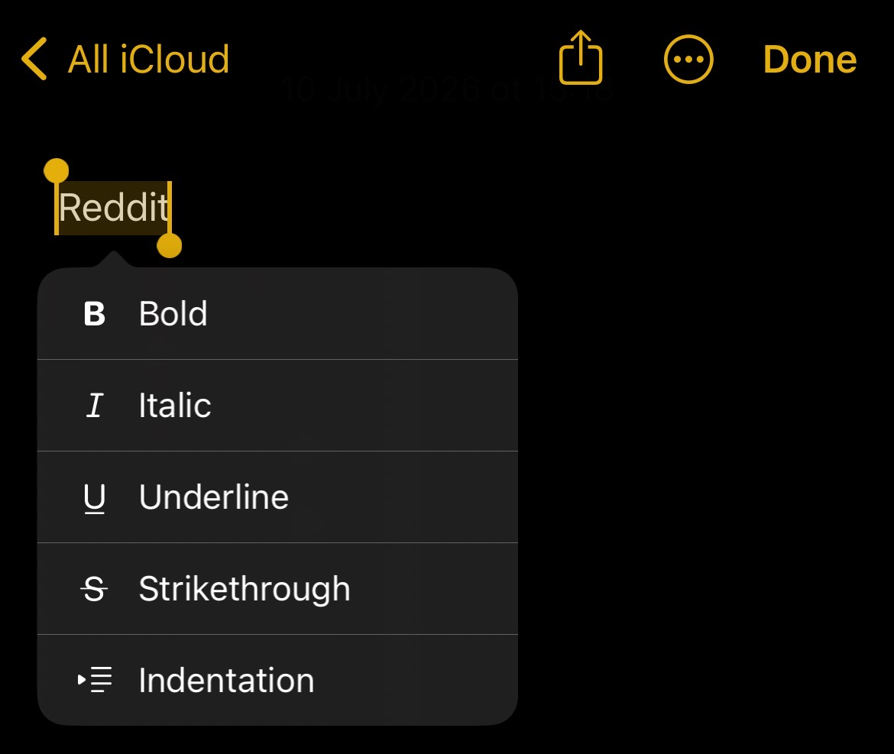

# TextMenuPlus

Compact vertical edit menu for iOS 16 rootless jailbreaks.

I missed having a vertical edit menu on iOS 16. Scrolling left and right through the default menu gets old fast.

Inspired by FancySelection by MiRO92.

## What it does

- Makes the iOS edit menu vertical and scrollable.
- Adds icons to common actions.
- Adds Text Case and Format menus.

## Compatibility

- Tested on iOS 16.4.1

## License

MIT
